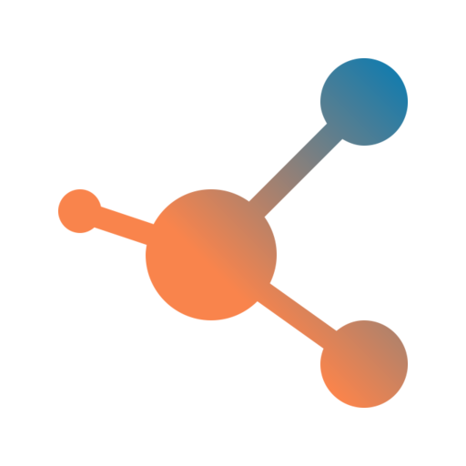

<p align="center">
    <a href="#" target="_blank">
        
    </a>
</p>

<p align="center">
    <a href="https://github.com/sixpeteunder/website/actions/workflows/code-quality.yml" target="_blank">
        
    </a>
</p>

## Website

Maseno Hub website concept. Built on [TALL](tallstack.dev/) stack:

- [TailwindCSS 2.x](https://tailwindcss.com/)
- [AlpineJS 2.x](https://github.com/alpinejs/alpine)
- [Laravel 8.x](https://laravel.com)
- [Livewire 2.x](https://laravel-livewire.com)

## Project setup
```bash
composer install
npm install
```

## Build frontend assets
```bash
npm run dev
```

## Migrate database
```bash
php artisan migrate
```

## Start a local development server
```bash
php artisan serve
```

## Contributing

- Always start a feature branch, avoid pushing directly to master.
- Make sure all checks are passing (use the `composer code:check` and `composer code:fix` helpers)

## License

The Maseno Hub website is open-sourced software licensed under the [MIT license](https://opensource.org/licenses/MIT).
